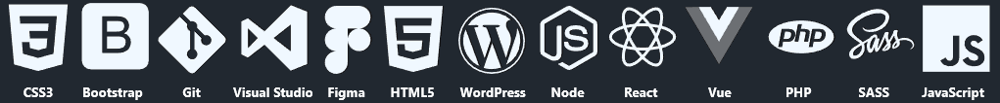
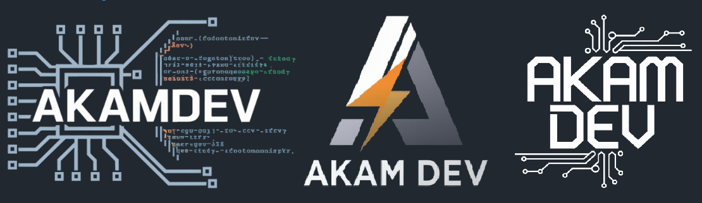

# <h1 align="center"> Adriano Ferreira de Oliveira  - Em Construção...</h1>

<h3 align="center" style="font-size: 48px;">⌨️ Desenvolvedor FullStack, Sites, Aplicativos e Softwares ⌨️</h3>

  

<table>
  <tr>
    <td></td>
    <td>
      Me chamo Adriano Ferreira de Oliveira e sou estudante de Engenharia da Computação na UNIMAR. Tenho grande paixão por tecnologia e jogos. Atualmente, atuo como desenvolvedor full stack autônomo, compartilhando meus projetos no Instagram <a href="https://www.instagram.com/akam_dev/">Akam DEV</a> e disponibilizando alguns para venda em minha loja online <a href="https://www.instagram.com/akam_dev/">Akam Tech</a>. Você pode acessar meu portfólio através do seguinte link: <a href="https://www.instagram.com/akam_dev/">Portfolio</a>

## 🌐 Redes Sociais

 

    </td>
  </tr>
</table>

<table>
  <tr>
    <td>
      <h3>Tabela de Projeto</h3>
      <table>
        <tr>
          <th>Projeto</th>
          <th>Status</th>
          <th>Plataforma</th>
        </tr>
        <tr>
          <td>Akam Pixel</td>
          <td>✅ Concluído</td>
          <td>Windows</td>
        </tr>
        <tr>
          <td>Ligeirinho App</td>
          <td>🔄 Em Progresso</td>
          <td>Android</td>
        </tr>
        <tr>
          <td>BeautyGo</td>
          <td>❌ Não Iniciado</td>
          <td>Android</td>
        </tr>
        <tr>
          <td>Person Assist</td>
          <td>❌ Não Iniciado</td>
          <td>Multi</td>
        </tr>
        <tr>
          <td>App Indefinido</td>
          <td>❌ Não Iniciado</td>
          <td>indefinido</td>
        </tr>
      </table>
    </td>
    <td>
      <h3>Tabela de Tecnologia</h3>
      <table>
        <tr>
          <th>Tecnologia</th>
          <th>Nível</th>
        </tr>
        <tr>
          <td>C# & Unity</td>
          <td>⭐⭐⭐⭐⭐</td>
        </tr>
        <tr>
          <td>Python</td>
          <td>⭐⭐⭐⭐⭐</td>
        </tr>
        <tr>
          <td>JavaScript</td>
          <td>⭐⭐⭐</td>
        </tr>
        <tr>
          <td>SQL</td>
          <td>⭐⭐⭐⭐</td>
        </tr>
        <tr>
          <td>Firebase</td>
          <td>⭐⭐⭐⭐⭐</td>
        </tr>
      </table>
    </td>
    <td>
      <h3>Horários de Trabalho</h3>
      <table>
        <tr>
          <th>Dia da Semana</th>
          <th>Inicio</th>
          <th>Fim</th>
        </tr>
        <tr>
          <td>Segunda-feira</td>
          <td>07:00</td>
          <td>17:00</td>
        </tr>
        <tr>
          <td>Terça-feira</td>
          <td>07:00</td>
          <td>17:00</td>
        </tr>
        <tr>
          <td>Quarta-feira</td>
          <td>07:00</td>
          <td>17:00</td>
        </tr>
        <tr>
          <td>Quinta-feira</td>
          <td>07:00</td>
          <td>17:00</td>
        </tr>
        <tr>
          <td>Sexta-feira</td>
          <td>07:00</td>
          <td>17:00</td>
        </tr>
      </table>
    </td>
  </tr>
</table>

# <h1 align="center"> 🤖 Linguagens e Tecnologias</h1>

 

  
 

👋 Trabalho com diversas linguagens e ferramentas para criar soluções inovadoras.

💻 Tecnologias e ferramentas que utilizo: 
✔️ C# & Unity – Desenvolvimento de aplicativos e jogos 
✔️ Python – Automação, inteligência artificial e scripts avançados 
✔️ JavaScript & React – Desenvolvimento web e interfaces interativas 
✔️ C++ – Aplicações de alto desempenho 
✔️ Banco de Dados – SQL, Firebase e NoSQL 

🚀 Atualmente, estou desenvolvendo alguns projetos mas ainda em contrução
🔗 Me acompanhe para mais projetos e novidades!

# 💻 Conhecimentos:
                                                

  
  

<!--  -->

<h3 align="center">Se Gosta do meu trabalho, considere me pagar um cafe 🥺👉👈</h3>
<h3 align="center">
</h3>
 

    

---

<!-- Proudly created with GPRM ( https://gprm.itsvg.in ) -->

